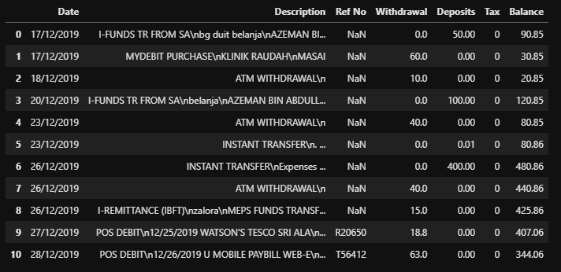

# Bank Statement Digitization
Optical character recognition (OCR) is a subset of machine vision technology that focuses on recognizing written letters and characters and reproducing them digitally for later use. This opens up many possibilities for banking industry, including security solutions, and document digitization. In this project, we parsed the transactions in bank statements from PDF files into excel files using Camelot library. Also, we added other important informations from the documents using Tensorflow Object Detection API and Google Tesseract.

## How to use this repository?
### <b>a) Create a virtual environment using anaconda</b>
  - Install python 3.7

### <b>b) Check your computer's CUDA driver version.</b>
  - We used CUDA 11.2 and it is only compatible with Tensorflow 2.5.0
  - Please make sure you install the correct CUDA, & CUDNN for your machine with the correct Tensorflow version
  - Refer this table for confirmation https://www.tensorflow.org/install/source#gpu
  
### <b>c) Open the train directory and clone the labelImg repository</b>
  - git clone https://github.com/tzutalin/labelImg.git
  
### <b>d) Open the train directory and clone the tensorflow/models repository</b>
  - git clone https://github.com/tensorflow/models.git
  
### <b>e) Install dependencies</b>
  - conda install cudatoolkit
  - pip install -r 'requirements.txt'
  - obtain 'test_cimb' from repo owner

### <b>f) Install Poppler</b>
  - Install poppler from here: https://blog.alivate.com.au/poppler-windows/
  - Add bin location to PATH

### <b>g) Copy protos from tensorflow directory to anaconda environment </b>
  - Copy all files from '..\models\research\object_detection\protos' to '..\anaconda3\envs\<env_name>\Lib\site-packages\object_detection\protos'

### <b>h) Change object detection path in requirements.txt </b>
  - At line 67, change 'object-detection @ file:///../Bank_Statement_Digitization/train/models/research' accordingly

### <b>i) Change copy setup.py file to research directory </b>
  - Copy setup.py from '..\models\research\object_detection\packages\tf2' to '..\models\research'

### <b>j) Put the bank statements dataset in the train/raw_dataset directory</b>
  - Ensure the PDF files are all text based

### <b>k) Download(https://drive.google.com/drive/folders/1eIoO2t0J5YVVkJJhK9Srbktz9N8kW_5A?usp=sharing) Maybank model (from gdrive) and put in eagleye_ocr/bank_ocr</b>

### <b>l) Download(https://drive.google.com/drive/folders/1xNLgTlmYXtCoQ6bMPjAEm9lyLBo6WuQR?usp=sharing) Tesseract-OCR (from gdrive) and put in C:/Program Files/</b>

### <b>m) Run python manage.py makemigrations from eagleeye_ocr folder</b>

### <b>n) Run python manage.py migrate</b>

### <b>o) Run python manage.py runserver to start server</b>

### <b>p) Output folder for eagle eye db is at media/eagleyedb</b>

### <b>q) Run the scripts in sequence</b>(Dont Need for Setting up)
  
  - Before running the scripts, ensure that all paths are correctly defined
    - Run preprocess_images.py
    - Run label_images.py
    - Run augment_images.py
    - Run split_dataset.py
    - Run create_csv_file.py
    - Run create_tf_records.py
    - Run download_model.py
    - Run configure_settings.py
    - Run train.py
    - Run valid.py
    - Run tensorboard.py
    - Run test.py
    - Run pdf_extract_table.py
    - Run extract_metadata.py

### <b>r) Example of prediction output</b>

